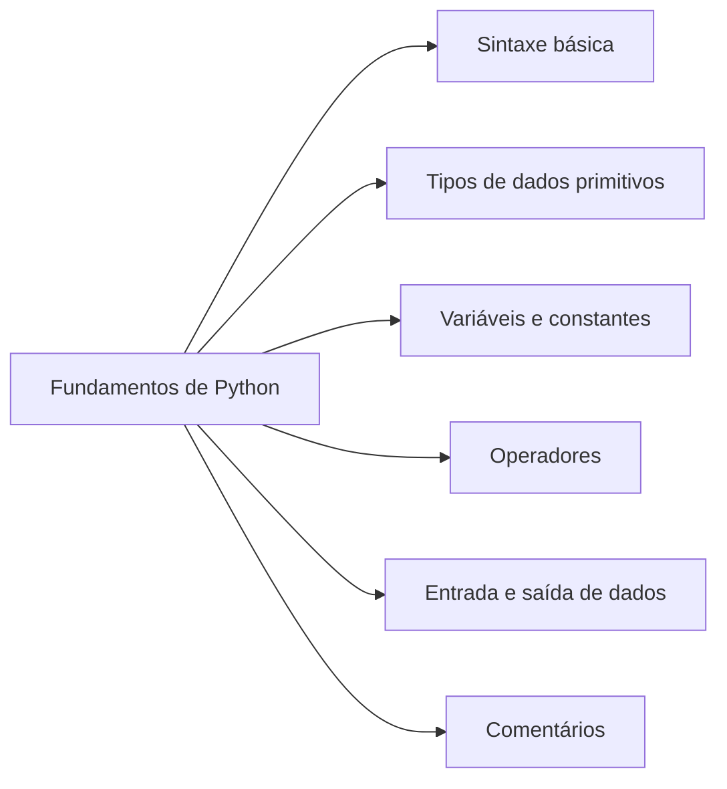

```mermaid
graph LR
  FD[Fundamentos de Python]
  FD --> 1[Sintaxe básica] 
  FD --> 2[Tipos de dados primitivos]
  FD --> 3[Variáveis e constantes]
  FD --> 4[Operadores]
  FD --> 5[Entrada e saída de dados ]
  FD --> 6[Comentários]

```
