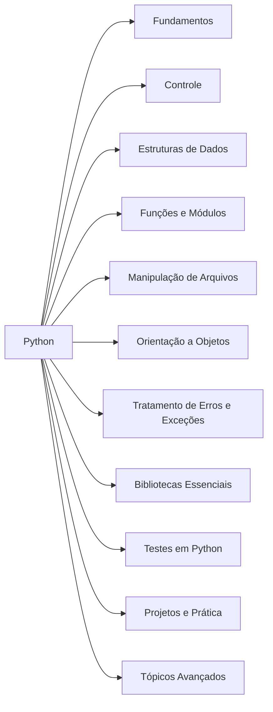

```mermaid
graph LR
  Python --> 1[Fundamentos] 
  Python --> 2[Controle]
  Python --> 3[Estruturas de Dados]
  Python --> 4[Funções e Módulos]
  Python --> 5[Manipulação de Arquivos]
  Python --> 6[Orientação a Objetos]
  Python --> 7[Tratamento de Erros e Exceções]
  Python --> 8[Bibliotecas Essenciais]
  Python --> 9[Testes em Python]
  Python --> 10[Projetos e Prática]
  Python --> 11[Tópicos Avançados]
```
